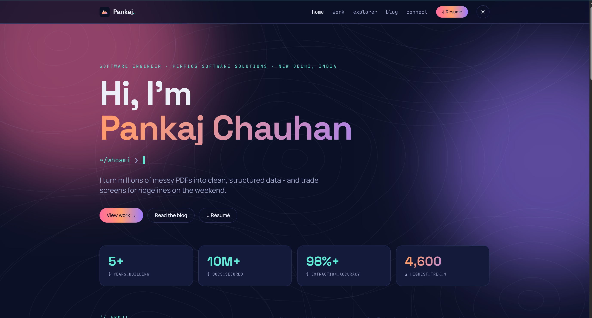
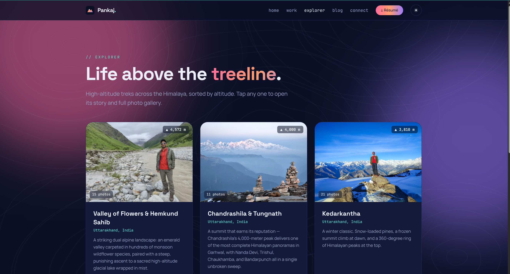

# Pankaj Chauhan — Portfolio

Personal portfolio of **Pankaj Chauhan**, Software Engineer at Perfios Software Solutions. Built with Flask, styled with Tailwind, deployed as a static site on Cloudflare Pages.

[](https://pankaj-sde.pages.dev)

---

<!-- Add portfolio screenshots here -->



## What's inside

| Section | Description |
|---|---|
| **Home** | About, experience, skills, and certifications |
| **Work** | Projects with descriptions and links |
| **Explorer** | Trek gallery — Valley of Flowers, Kedarkantha, Badrinath, Chandrashila |
| **Blog** | Technical writing in Markdown |
| **Résumé** | Downloadable PDF |

## Stack

- **Backend** — Python, Flask, Frozen-Flask (static build)
- **Frontend** — Tailwind CSS, Vanilla JS
- **Deployment** — Cloudflare Pages (auto-deploy on push)
- **Content** — JSON + Markdown, fully data-driven

## Run locally

```bash
git clone https://github.com/PankajChauhanji/my_portfolio.git
cd my_portfolio
pip install -r requirements.txt
flask --app app run --debug
```

Open **http://localhost:5000**

## Contact

[GitHub](https://github.com/PankajChauhanji) · [LinkedIn](https://www.linkedin.com/in/pankaj-chauhan-sde/) · [pankajchauhan.nitsri@gmail.com](mailto:pankajchauhan.nitsri@gmail.com)

---

© 2026 Pankaj Chauhan